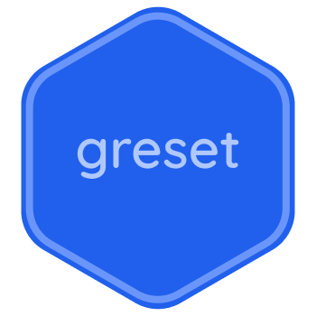

<div align="center">
    
</div>

# greset

greset is an opinionated reset (and normaliser) based on the most popular resets to date!

Main features:

- The best box sizing: `box-sizing: border-box`
- Designed with newer browsers in mind
- Reactive font sizes thanks to [rfs](https://getbootstrap.com/docs/5.0/getting-started/rfs/)
- Semantic html first
- Autoprefixer used


# Use

You can by importing or cdn:

-   CDN (easiest method)

    ```html
    <link
        rel="stylesheet"
        href="https://cdn.jsdelivr.net/npm/greset@2/greset.css"
    />
    ```

-   When using bundlers such as vite or rollup

    ```bash
    npm install greset -D
    ```

    ```js
    import 'greset';
    ```

-   CSS Import
    
    ```bash
    npm install greset
    ```

    ```css
    @import 'node_modules/greset/greset.css';
    ```

# Migrating from v1

- Changing imports:
    We moved from publishing in `/css/greset.css` to just `/greset.css`. You can see about [how to import greset v2 here](#use) 

- CSS Changes:
    Most of the css we removed was only targeting very old browsers. However there might be some CSS that effect your modern code, as such it's only recommended to update on newer or maintained projects. No point migrating old projects to the new version.

# Changes

Please feel free to [suggest changes](https://github.com/ghostdevv/greset/issues/new), all help is welcome in working to improve and maintain greset.

# Credits

greset is based off my favourite, and popular resets I have found over the years, below I have tried to best share credit with the resources I have used

- [Modern Normalize](https://www.npmjs.com/package/modern-normalize)

- [Normalize](https://www.npmjs.com/package/normalize.css)

- [Eric Meyer](https://meyerweb.com/eric/tools/css/reset/)
